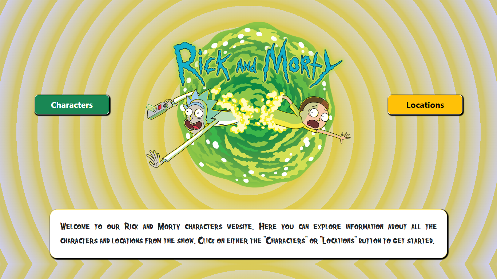

# React and Morty

## Introduction
The project is a robust application inspired by the popular animated science-fiction series "Rick and Morty". This show, created by Justin Roiland and Dan Harmon, follows the dangerous and often outrageous adventures of eccentric, alcoholic scientist Rick Sanchez and his good-hearted but easily influenced grandson Morty Smith. The series is renowned for its unique characters and a vast number of inter-dimensional locations.

## Purpose
This application is developed to provide a platform for fans of the series to dive into the rich world of Rick and Morty, giving them access to in-depth information about their favourite characters and the intriguing locations they encounter during their inter-dimensional escapades.

## Development
The application was developed using React, demonstrating the use of advanced React features such as Hooks and state management. It fetches data from an open-source API in a sequential manner, which enables the implementation of pagination for an improved user interface.

## Functionality
The application has three primary sections:
1.	Landing Page: This is the first page users see, from which they can choose to explore characters or locations.
2.	Character List: This section displays a comprehensive list of characters from the show. Clicking on a character will provide detailed information about the character.
3.	Location List: This part of the application showcases the various locations featured in the series, with additional information available for each location.

## Conclusion
In summary, this application serves as a valuable tool for exploring and understanding the diverse characters and locations within the Rick and Morty universe. The primary focus of this project has been to demonstrate the effective use of React and related technologies in developing a user-friendly interface, while emphasizing efficient data management and responsive design. The project leverages modern tools like React Hooks and state management to fetch and handle data from an API in a way that enhances user experience. Although created with Rick and Morty fans in mind, its true accomplishment lies in the proficient use of these tools and techniques to create a practical, data-driven application.

## Screenshot

Landing page screenshot:

